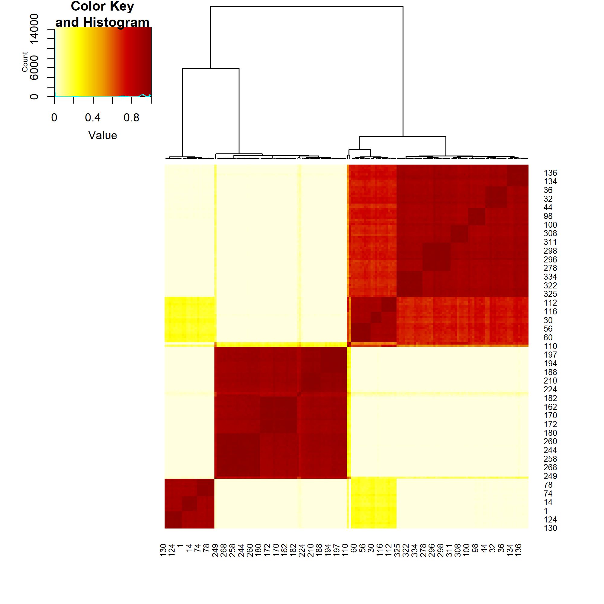

<!-- README.md is generated from README.Rmd. Please edit that file -->

# `RFCLUST`

<!-- badges: start -->

[](https://github.com/sistm/RFCLUST/actions/workflows/R-CMD-check.yaml)
<!-- badges: end -->

`RFCLUST` performs Random Forests of Divisive Monothetic ([`divclust`](https://github.com/chavent/divclust)) Trees for Unsupervised Clustering.

## Installation

You can install the development version of RFCLUST from [GitHub](https://github.com/).

`RFCLUST`depends on a customized implementation of the [`divclust`](https://github.com/chavent/divclust) package, that must
first be installed with the following:

``` r
# install.packages("remotes")
remotes::install_github("sistm/divclust")
```

Then, `RFCLUST` can be installed with:

``` r
remotes::install_github("sistm/RFCLUST")
```

## Example

``` r
library(RFCLUST)
library(palmerpenguins)

# Prepare data
mypeng <- as.data.frame(penguins)
mypeng$year <- factor(as.character(mypeng$year),
                      levels = c("2007", "2008", "2009"),
                      ordered = TRUE)

# Run RFCLUST on male penguins
forest_clust <- rfclust(
  na.omit(mypeng[mypeng$sex == "male", -c(1, 7)]),
  ntrees = 50, mtry = ncol(na.omit(mypeng[mypeng$sex == "male", -c(1, 7)])), distance = "co-clustering",
  ncores = 1
)
#> We advise you to use the `summary()` on this object to aggregate the results of this forest before plotting.

# Aggregate results
resume <- summary(forest_clust)

# Plot summary
plot(resume)
```




